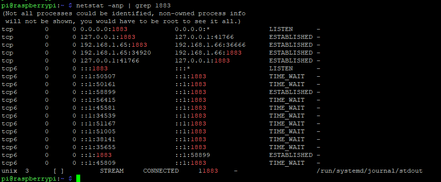
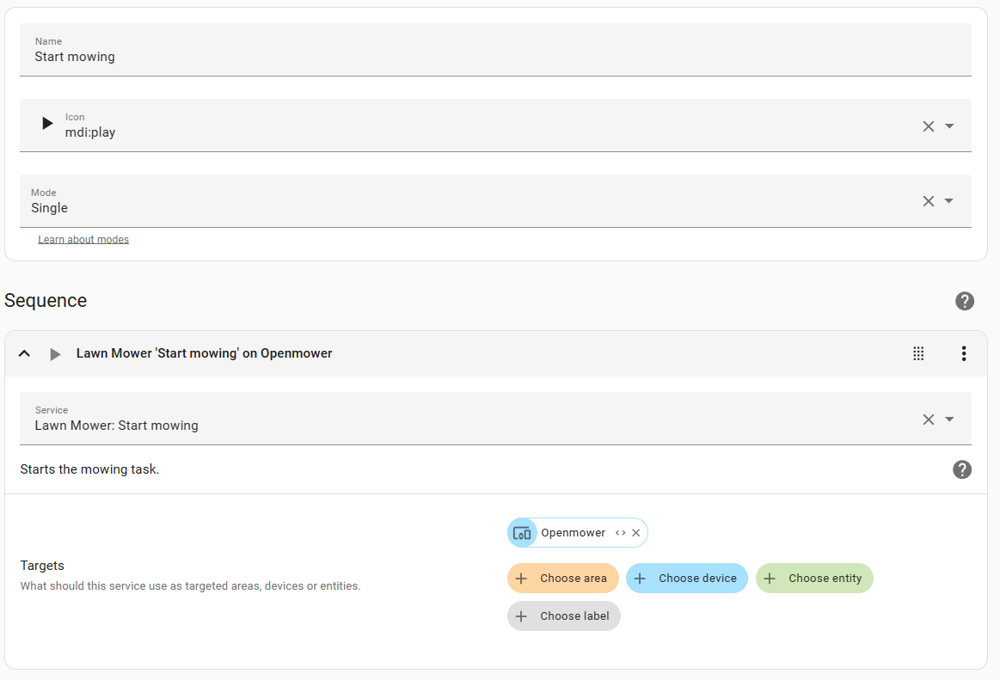

OpenMower integration for HomeAssistant
===

Openmower is the DIY RTK GPS Smart Mowing Robot for Everyone! Based on the YardForce classic 500 lawn mover and fully open source. A custom built motherboard, a raspberry pi and a GPS module gets rid of the guide wire and makes software the key factor in the project.

[openmower.de](https://openmower.de/)

[Openmower on github](https://github.com/ClemensElflein/OpenMower)

This integration is based on MQTT messages from the openmower container that runs on the RPI. 

It will give you full control over the mower. Buttons to start, stop, pause, create automations from etc. Statistics like battery load, motor temperature, location. GPS coordinates are integrated into the device tracker.


Prerequisites
===
* A functional openmower (doh!)
* A software version where MQTT is supported, currently only on the edge version.
* Activated MQTT in openmower config (/boot/openmower/mover_config.txt)
```
export OM_MQTT_ENABLE="True"            # Enable or disable
export OM_MQTT_HOSTNAME="10.2.3.4"      # IP or hostname of your HA
export OM_MQTT_PORT="1883"              # Port, default 1883
export OM_MQTT_USER="mqtt_om"           # MQTT user on your HA
export OM_MQTT_PASSWORD="mqtt_om"       # MQTT password on your HA
export OM_MQTT_TOPIC_PREFIX="openmower" # The prefix that all MQTT traffic from this mower should have. If you have multiple mowers this can be used to separate them.
```
* Home assistant with HACS
* Mosquitto or similar MQTT broker. Mosquitto is the easiest to install, you find it in the add-on store. 


Once installed it will turn up in the normal integrations as MQTT.


Installation
===

Install via HACS by adding https://github.com/vermut/ha_openmower.git as a Custom Repository. Refresh HACS, go to Openmower and download the integration.

Add the integration in settings -> integrations. Here you fill in the details for your mower. I.e. the prefix and the LAT/LONG from the openmower config file.


Your mower should now turn up in Home assistant




On the lawn_mower.openmower you have the start/pause/return to home commands.


If you want to expose those buttons directly in the dashboard, add them as scripts:



Troubleshooting
===
Verify that mqtt is active on the openmower and check if xbot_monitoring is connected to homeassistant.
```
openmower@openmower:~ $ sudo netstat -pnt | grep 1883 | grep xbot_monitoring
tcp        0      0 127.0.0.1:42818         127.0.0.1:1883          ESTABLISHED 911/xbot_monitoring
tcp        0      0 <MOWER_IP>:43340     <HOMEASSISTANT_IP>:1883      ESTABLISHED 911/xbot_monitoring
```
Verify that messages actually reach HA. In the MQTT integration listen for topic # or e.g. openmower/# if your prefix is openmower.


Additional resources
===

[RPI MQTT monitor](https://github.com/2m/rpi-mqtt-monitor-docker)
Nice way to get stats from the RPI into your HA. Install as a service/container on the RPI. In Mosquitto you add a bridge config for the messages.


Place the config file in /share/mosquitto in your HA and set active to true, remember to do it IN the HA container if you run like that.

**HA built in GIT integration**

For those staying on the edge(!) of development, see what the latest commits are. Update or not?

**HA automation examples**

prisukamas delivers this automation. "I'm using this automation to send a pushover if mower is i IDLE state for > 10 mins and not charging with battery level lower than 98%, works fine:"


    - alias: "OpenMower Failed Docking Alert"
      trigger:
        platform: state
        entity_id: sensor.openmower_current_state
        to: 'IDLE'
        for:
          minutes: 10
      condition:
        - condition: state
          entity_id: binary_sensor.openmower_is_charging
          state: 'off'
        - condition: numeric_state
          entity_id: sensor.openmower_battery
          below: 98
      action:
        service: notify.pushover
        data:
          message: "OpenMower possibly failed to dock Battery level is {{ states('sensor.openmower_battery') }}%."

2m has this automation. "I am also using this automation to send a push notification to phones running Home Assistant app when OM enters emergency mode:"

    - alias: OpenMower Emergency -> Mobile Notification
      description: ""
      trigger:
        - platform: state
        entity_id:
            - binary_sensor.openmower_emergency
        from: "off"
        to: "on"
      condition: []
      action:
        - service: notify.openmower_notification_devices
          data:
            title: OpenMower Emergency
            message: OpenMower got into the emergency mode
            data:
              clickAction: lovelace/4
              color: red
      mode: single

Here notify.openmower_notification_devices is defined in configuration.yaml as:

    notify:
    - name: openmower_notification_devices
        platform: group
        services:
        - service: mobile_app_pixel_8_pro
        - service: mobile_app_pixel_tablet
        - service: mobile_app_pixel_5

pinussen has this to start mowing if rain has not fallen or is predicted today. The rain sensor was set up following this Smart home junkie [video](https://www.youtube.com/watch?v=e8mlJBce3uQ)

    alias: Mow the lawn
    description: ""
    trigger:
    - platform: sun
        event: sunrise
        offset: "3:00:00"
    condition: []
    action:
    - choose:
        - conditions:
            - condition: numeric_state
              entity_id: sensor.total_rain_fallen_plus_expected
              below: 1
            - condition: numeric_state
              entity_id: sensor.openmower_battery
              above: 95
            - condition: state
              entity_id: sensor.openmower_current_state
              state: IDLE
            sequence:
            - service: button.press
              data: {}
              target:
                entity_id: button.openmower_start_mowing
    mode: single


**Button scripts**

Example of script to start the mowing. 

    alias: Start mowing
    sequence:
    - service: lawn_mower.start_mowing
      metadata: {}
      data: {}
      target:
        device_id: 2f51ea5d53384b5c8af44e3874fa295f
    mode: single
    icon: mdi:play

Added in the dashboard like this:

    cards:
    - type: entity
      entity: lawn_mower.openmower
    - type: horizontal-stack
      cards:
        - show_name: true
          show_icon: true
          type: button
          tap_action:
            action: toggle
          entity: script.start_mowing
          icon: mdi:play
          name: Start

**Example dashboards**

[simple dashboard](docs/dashboard.yml)

[simple dashboard with GIT integration and raspberry monitor](docs/dashboard-with-git-n-rpistats.yml)
